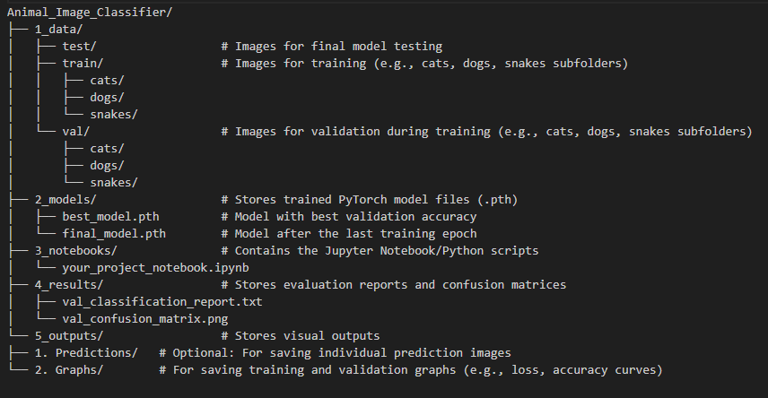

# Infotech College of Business and IT - Machine Learning with Advanced Python
# Project 01 - Animal Image Classifier using CNN

## Project Overview
This project focuses on building a Convolutional Neural Network (CNN) to classify images of animals. The model is developed using PyTorch and leverages transfer learning techniques.

## Domain
Computer Vision

## Dataset
The project utilizes the Animal Image Classification Dataset.
**Dataset Source:** [Kaggle: Animal Image Classification Dataset](https://www.kaggle.com/datasets/borhanitrash/animal-image-classification-dataset/data)

## Key Skills Practiced
* Image Preprocessing
* CNN Architecture with PyTorch
* Model Evaluation (Accuracy, Precision, Recall, F1-Score, and Confusion Matrix)

## Tasks
The following tasks were performed as part of this project:
* Load and preprocess the image dataset
* Design a 2-3 layer CNN (using a pre-trained ResNet-18 model)
* Train, validate, and test the model
* Visualize predictions using Matplotlib

## Folder Structure
The project is organized with the following directory structure:



## How to Run the Code

1.  **Clone the Repository (if applicable):**
    ```bash
    git clone <your-repo-url>
    cd Animal_Image_Classifier
    ```

2.  **Install Libraries:**
    Ensure you have all the required libraries by running:
    ```bash
    pip install -r requirements.txt
    ```
    (torch, numpy, torchvision, matplotlib, time, os, PIL, tempfile, scikitlearn, seaborn, pandas)

3.  **Prepare the Dataset:**
    Download the dataset from the Kaggle link provided above and place the `train`, `val`, and `test` subdirectories into the `1_data` folder as per the folder structure.

4.  **Run the Jupyter Notebook:**
    Open the `your_project_notebook.ipynb` (or similar name) located in the `3_notebooks` directory using Jupyter Notebook or JupyterLab and execute the cells sequentially.

    The notebook will:
    * Load and preprocess images.
    * Initialize and train two models: a fine-tuned ResNet-18 model and a ResNet-18 feature extractor.
    * Save the trained models in the `2_models` directory.
    * Visualize model predictions.
    * Generate and save classification reports and confusion matrices in the `4_results` directory.
    * Display training and validation graphs (if plotting code is included to save them in `5_outputs/2. Graphs`).

## Model Performance and Evaluation

The project evaluates the performance of both the fine-tuned CNN model (`model_ft`) and the transfer learning feature extraction model (`model_conv`) on the validation dataset.

The evaluation includes:
* **Loss and Accuracy per Epoch:** Printed during the training process for both training and validation phases.
* **Classification Report:** Provides precision, recall, f1-score, and support for each class.
* **Confusion Matrix:** Visualizes the number of correct and incorrect predictions for each class.

These evaluation reports (`_classification_report.txt` and `_confusion_matrix.png`) are saved in the `4_results` directory for both models, allowing for direct comparison of their classification abilities.
